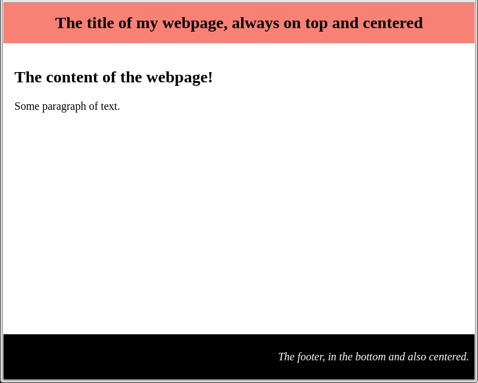
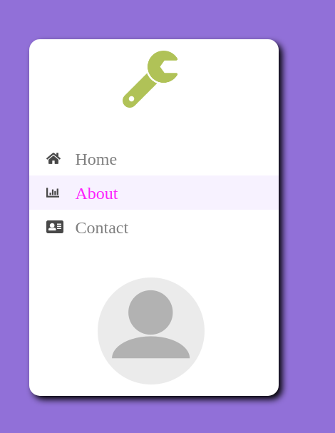

# Flex Box

Flex box is a new display type, designed to be more flexible (/responsive) than previous inline/block/block-inline display. Flex-box is specifically adapted to define the layout of an array of elements inside a container.


Consider the following code

```html
<div class="container">
	<div class="item">1</div>
	<div class="item">2</div>
	<div class="item">3</div>
	<div class="item">4</div>
	<div class="item">5</div>
</div>
```

```css
.container {
	
	height: 75vh;
	width: 75vw;
	margin-left: auto;
	margin-right: auto;
	margin-top: 5vh;
	background-color: lightgray;

	display: flex;
}

.item {
	background-color: yellow;
	border: 2px solid black;
	text-align: center;
	font-size: 1.5em;

	margin: 5px;
	width: 100px;
	height: 100px;
}
```

## Property of the container

* __flex-direction__ allow to set the direction of the items (left to right, top to bottom, etc).
<br/>
Try the following direction:<br/>
   * row (default)
   * row-reverse
   * column
   * column-reverse

* __flex-wrap__ allow the items to wrap inside the container when needed.
<br/>
Try the following options:<br/>
  * no-wrap (default)
  * wrap
  * wrap-reverse


* __justify-content__ allow to set the horizontal placement of the items and space between items.
<br/>
Try the following options:<br/>
  * flex-start (default)
  * flex-end
  * center
  * space-between
  * space-around

* __align-content__ allow to set the vertical placement and space between lines of items. Align-content acts when items span several lines of contents.
<br/>
Test the following options (change the width of the items to ensure that they span multiple lines):<br/>
  * stretch (default, items should not have fixed height)
  * center
  * flex-start
  * flex-end
  * space-between
  * space-around

* __align-items__ allow to set the vertical placement and size of the items, even if there is only one line of items.
<br/>
Comment out the height of item in the CSS, and try the following options:<br/>
  * stretch (default, items should not have fixed height)
  * center
  * flex-start
  * flex-end

## Property of items

Items can have specific properties.

* __flex-grow__ / __shrink__: allow to define the ability of an item to grow/shrink within the container.

Exemple:
```html
<div class="container">
	<div class="item">1</div>
	<div class="item">2</div>
	<div class="item grow">3</div>
	<div class="item">4</div>
	<div class="item">5</div>
</div>
```

```css
.item {
	background-color: yellow;
	border: 2px solid black;
	text-align: center;
	font-size: 1.5em;

	margin: 5px;
	flex-grow: 1;
	height: 100px;
}

.grow  {
	flex-grow: 2;
}
```

Note that the third item will grow twice more than the other items.

* Note: seting `margin: auto;` for an item in a flex container allows to center it both in horizontal and vertical axis.


## Grid layout

Flex-box focuses on arranging array of items. A newer CSS layout is also developed to handle grid type items: [CSS-grid](https://www.mozilla.org/en-US/developer/css-grid/).

Note that CSS-grid is still recent, and older browser may not be able to handle it.


## Exercices


__Q.__ Write the CSS code that mimic the behavior of the webpage `01_header_footer`, provided the following html content

```html
<body>
<article>
	<header>
		<h1>The title of my webpage, always on top and centered</h1>
	</header>

	<section>
		<h2>The content of the webpage!</h2>
		<p> Some paragraph of text. </p>
	</section>

	<footer>
		<p>The footer, in the bottom and also centered.</p>
	</footer>

</article>
</body>
```



_Hint:_ The article can be a flex container with column direction. Header and footer can be flex containers with specific `justifify-content`.

__Q.__ Create the html and css code copying the style of the webpage `02_app_layout`.



Note. The shadow can be created by the [box-shadow](https://developer.mozilla.org/en-US/docs/Web/CSS/box-shadow) property.