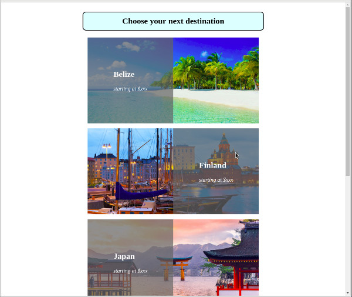

# Position

Position allow to place elements in a "floating" mode in the page of relative to their containing element.

Position can take the following values
* __static__: default mode, static elements cannot be moved from their position in the page flow.
* __relative__: set an offset from the normal static position.
* __fixed__: set a fixed position with respect to the viewport of the window.
* __absolute__: set a fixed position with respect to the containing element.

The position of the fixed, absolute, or relative position can be set by an offset value given by top, bottom, right, left.

## Relative

__Q.__ Try the following code

```html
<div id="bloc1"> </div>
<div id="bloc2"> </div>
<div id="bloc3"> </div>
```

```css
#bloc1 {
	width: 200px;
	height: 200px;
	background-color: red;
}

#bloc2 {
	display: inline-block;
	width: 200px;
	height: 200px;
	background-color: yellow;

	/*position: relative;*/
	top: -20px;
	left: 40px;
}

#bloc3 {
	display: inline-block;
	width: 200px;
	height: 200px;
	background-color: blue;

	/*position: relative;*/
	top: -60px;
	left: -50px;
}
```

Uncomment the `position: relative`, and observe the new placement of each element.
Note that `top` and `left` have no influence on the default static position.

__Q.__ Add a [z-index](https://developer.mozilla.org/en-US/docs/Web/CSS/z-index) to the yellow and blue box. Change the relative index to make the yellow box appearing in front of the blue one. 

Similarily to `z-index` does not apply to elements with static position.

__Q.__ Add a relative position to the red box and a z-index so that it appears in front of the two others.


## Fixed

__Q.__ Try the following code


```html
<p id="fixed"> Text in fixed mode </p>

<p id="normal">
	Lorem ipsum dolor sit amet, consectetur adipiscing elit, sed do eiusmod tempor incididunt ut labore et dolore magna aliqua. Ut enim ad minim veniam, quis nostrud exercitation ullamco laboris nisi ut aliquip ex ea commodo consequat. Duis aute irure dolor in reprehenderit in voluptate velit esse cillum dolore eu fugiat nulla pariatur. Excepteur sint occaecat cupidatat non proident, sunt in culpa qui officia deserunt mollit anim id est laborum
</p>
```

```css
#normal {
	margin: 2em;
}

#fixed {
	position: fixed;
	top: 3em;
	left: 10em;

	background-color: yellow;
	border: solid 2px black;
	padding: 0.5em;
}
```

Note that the element in fixed mode is removed from the normal document flow, and placed at the position described by top and left.

__Q.__ Use the fixed mode to model the behavior of a menu that remains constantly on the screen as shown in example `01_fixed_menu`

Hints: 
* The transparent color can be defined by `rgba(r,g,b,a)`. The last number (alpha) defines the percentage of opacity (can be a number between 0 and 1).
* The textual content can be filled by automatic [text generator](http://www.blindtextgenerator.com/lorem-ipsum).

## Absolute

Absolute set a position defined with respect to the parent container with a relative position. If no container parent container has relative position, the position is set with respect to the viewport (similar to fixed position).

__Q.__ Try the following code

```html
<div id="bloc1"> 
    Lorem ipsum dolor sit amet, consectetur adipiscing elit, sed do eiusmod tempor incididunt ut labore et dolore magna aliqua. Ut enim ad minim veniam, quis nostrud exercitation ullamco laboris nisi ut aliquip ex ea commodo consequat. Duis aute irure dolor in reprehenderit in voluptate velit esse cillum dolore eu fugiat nulla pariatur. Excepteur sint occaecat cupidatat non proident, sunt in culpa qui officia deserunt mollit anim id est laborum.
    <div id="bloc2"> </div>
    <div id="bloc3"> </div>
</div>
```

```css
#bloc1 {
	width: 400px;
	background-color: lightcyan;
	position: relative;
}

#bloc2 {
	display: inline-block;
	width: 100px;
	height: 100px;
	background-color: rgba(255,0,0,0.4);
	position: absolute;
	top: 15px;
	left: 15px;
}

#bloc3 {
	display: inline-block;
	width: 80px;
	height: 120px;
	background-color: rgba(100,200,0,0.4);
	position: absolute;
	top: 15px;
	right: 15px;
}
```

__Q.__ Create the html and css code following the behavior of the exercice `02_absolute`.

