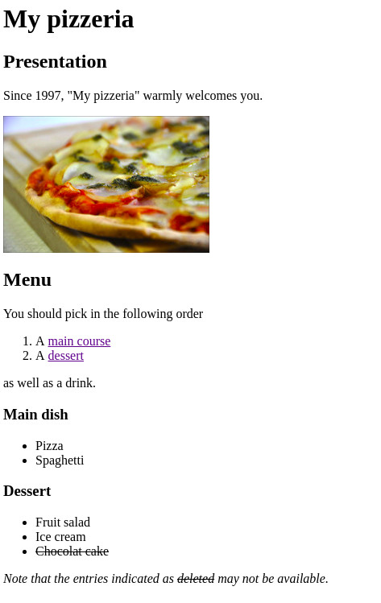

# HTML introduction

## Initial webpage

__Q.__ Create a first HTML webpage

* Create a file named _index.html_
* Edit this file using a text editor (see [available and recommended text editor](https://imagecomputing.net/damien.rohmer/teaching/2017_2018/semester_2/CSE_104/general_doc/general_reminder/index.html))
* Fill it with the following code

```html
<!DOCTYPE html>

<html>

<head>
	<title> CSE104 </title>
</head>

<body>
       <h1>My first webpage</h1>
       This is HTML code.
</body>

</html>
```

* Open the file using a web browser (for instance [Firefox](https://www.mozilla.org), [Google Chrome](https://www.google.com/chrome/browser)).

## HTML tags

The goal of HTML tags is to provide a structure to your document. Well placed tags allows to efficiently understand, and thus index (such as for Google search engine), your webpage. Tags may have defaul visual behavior (usually inherited from old time), however this visual appearance can be modified (see CSS later on). 

Therefore, as a good practice in HTML5, your choice of tag should be guided by its semantic meaning (/the structure of your document), and not by their visual appearance.


__Q.__ The following tags are often used and may be worth to remember. Experiment with them to observe they default behaviors. Do not hesitate to refer to the exhaustive list of HTML (see [W3School](https://www.w3schools.com/tags/), or [Mozilla Development Network](https://developer.mozilla.org/en-US/docs/Web/HTML/Element)) for more tags and info.


* [`<h2>`, `<h3>`, ..., `<h6>`](https://www.w3schools.com/tags/tag_hn.asp): Title tags

* [`<!-- -->`](https://www.w3schools.com/tags/tag_comment.asp): Comment tag

	ex. `<!-- This is a comment -->`

* [`<p>`](https://www.w3schools.com/tags/tag_p.asp): A paragraph of text

	ex. `<p> A paragraph of text </p>`

* [`<br>`](https://www.w3schools.com/TAgs/tag_br.asp): A line break.

	ex. '<p> A first line. <br> A second line.</p>'

* [`<a>`](https://www.w3schools.com/tags/tag_a.asp): A link to another webpage

	ex. `<a href="https://www.polytechnique.edu/en/bachelor">This is a link</a>`

* [`<strong>`](https://www.w3schools.com/tags/tag_strong.asp) and [`<em>`](https://www.w3schools.com/tags/tag_em.asp): Highlight text

	ex. `<p> <strong> Important text </strong>, and <em> emphasized text </em> </p>`


* [`<ul>`](https://www.w3schools.com/tags/tag_ul.asp) Unordered list

	ex. 
	```html
	<ul>
       <li>Element of unordered list</li>
       <li>Second element</li>
       <li>Third element</li>
         <ul>
         	<li> Element of neasted list </li>
         	<li> Second element</li>
         </ul>
    </ul>
    ```

* [`<ol>`](https://www.w3schools.com/tags/tag_ol.asp) Ordered list

	ex.
	```html
	   <ol>
       	<li> Element of ordered list </li>
       	<li> Second element </li>
       </ol>
    ```

* [``](https://www.w3schools.com/tags/tag_img.asp) Insert an image

	ex. ``

	

* [`<table>`](https://www.w3schools.com/tags/tag_img.asp) Insert a table

	ex.
	```html
	   <table>
       	<tr> <!-- First line -->
       		<td> A </td>
       		<td> B </td>
       		<td> C </td>
       	</tr>
       	<tr> <!-- Second line -->
       		<td> D </td>
       		<td> E </td>
       		<td> F </td>
       	</tr>
       </table>
    ```
_Note: Table should be used to visualize data which are organized as table (semantic meaningà, but not to place arbitrary elements in front of each other (visual appearance)_

* [`<q>`](https://www.w3schools.com/tags/tag_q.asp): Quote

	ex. <q> This is a quote </q>

* [`<sup>`](https://www.w3schools.com/tags/tag_sup.asp) and [`<sub>`](https://www.w3schools.com/tags/tag_sub.asp): Superscript, Subscript

	ex. `<p> x<sup>2</sup>, x<sub>i</sub> </p>`

	ex. `<p>&int; x<sup>2</sup> dx = x<sup>3</sup>/3 </p>`

* [`<s>`](https://www.w3schools.com/tags/tag_s.asp): Text that is no longer correct or relevant.

### HTML Validator

Browsers are usually not following strict HTML5 rules in order to be robust to syntax errors, and to avoid breaking old style HTML programming. They typically allow _incorrect_ html code to be rendered in a "correct" way, helping non expert developers to obtain quickly visual results. 
While, often, rendering correctly in browser, writting non standard code is considered as a bad practice. It may render differently on various browser, and may be rendered incorrectly in the future version of the browser.

A good practice consists in checking your HTML code in validator.
The [W3C Validator](https://validator.w3.org/) is a common tool to check that your code follows standard rules (browser extensions are also available).
Try to check regularily if your HTML code is valid, many typos and errors which are silencely rendered by your browser can be detected and cleaned up.

### Exercice

__Q.__ Try to immitate the webpage in the `exercice/` directory. Use when possible relevant tags instead of hard coded decorating characters.


<div style="width:500px; border:1px solid black">

</div>

