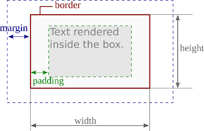
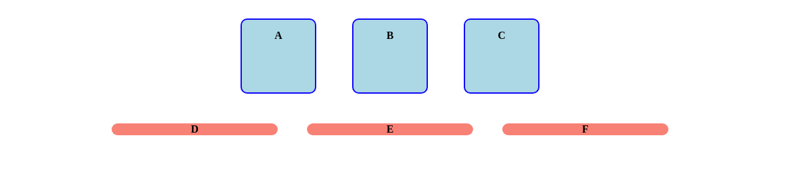

# CSS: Box Model


The [_HTML Box Model_](https://developer.mozilla.org/en-US/docs/Learn/CSS/Introduction_to_CSS/Box_model) defines the rectangular regions occupied by HTML elements.

The Box Model define each region by 
* a __margin__: the empty space between the neighboring box and the current one) 
* a [__border__](https://www.w3schools.com/css/css_border.asp) which can be visualized if needed
* a __padding__: the empty space between the border and the content inside the box. 

The __width__ and __height__ of a box corresponds to the size of the border (inside the margin).



_The HTML box model_

Each border (left, right, top, bottom) can be set individually if needed (ex. `margin-left`, `border-top`, etc.)

Each box can contain itself other boxes (Note that words of text can be interpreted itself as a box).


## Display

Some visual elements may exhibit varying behaviors. In some cases, the box itself has a specific meaning, and its size for instance may be fixed by the user. In other cases, the box itself has no meaning without internal content, thus its behavior is defined by its content.

* For instance, words in paragraphs should by default flow from left to right, and then from top to down when reaching the end of the line.
* Titles, on the opposite are displayed by default from top to down. Each new title is defined on its own line.
* Images, are displayed from left to right like words from paragraphs. However, at the opposite of words, its size such as width and height, should be fixed by the user, and not necessarily by its content.

These different behaviors are related to three display styles.

### Inline-block

Inline bloc elements is a typical rectangular box whose size, margin, padding can be fully defined by the user. Consecutive elements with inline-bloc display are rendered from left to right.
Images have inline-bloc display by default.

__Q.__ Run the html webpage from the exercice directory with the following body

```html


```

Note that each element is placed from left to right. (if you reduce your window width, elements exceeding the size of a line will go to the next line).

__Q.__ Add the following content in the CSS file in order to visualize each box separately

```css
body {
	background-color: rgb(240,240,240);
}
img {
	background-color: cyan;
    border: 2px solid blue;
    padding: 10px;
    margin: 20px;
}
```

Note the cyan space between the box border and the content (here the image) indicating the action of the padding.

Change the size (width, height) of the `` and observe the results.

### Block

Block is used to display elements spanning an entire line. Consecutive blocks elements are displayed from top to down, a new line is started at each new elements. Blocks can have user defined size and margin.
Containers of texts such as titles `<h1>`, ..., `<h6>`, as well as paragraphs `<p>` have block display by default.

__Q.__ Run the html webpage from the exercice directory with the following body

```html
<h1> Title </h1>
<h1> Another title </h1>
<h2> A sub-title </h2>
<p> A text paragraph </p>
<p> A longer text paragraph. ex. from Moby Dick: ... </p>
```

Note that each new element is displayed on a new line.

__Q.__ Add the following content in the CSS file in order to visualize each block structure

```css
h1 {
	background-color: yellow;
	border: 2px solid blue;
}
h2 {
	background-color: orange;
	border: 2px solid red;
	height: 80px;
	width: 200px;
}
p {
	background-color: rgb(200,200,200);
	border: 2px solid black;
	padding: 15px;
	margin: 30px;
	width: 800px;
}
```

Note that when the width is not fixed by the user, the container expands along the entire width of the parent element (here the size of the window for `<h1>`).


### Inline

Inline is used to display element with a _text-like_ behavior. Inline element has width and height that adapts to its content and cannot be set from the CSS style. Padding and margin are acting on left and right (similarily to margin in written paper), but are not adapted to work for top and bottom.

Tags highlighting words with some properties such as `<a>`, `<em>`, `<strong>` have by default inline display behavior.

__Q.__ Run the html webpage from the exercice directory with the following body

```html
<p> Links have <a href="https://www.w3schools.com/cssref/pr_class_display.asp"> inline display</a>.</p>  
<p> <em> Emphasized </em>, or <strong> strong </strong> highlighted words have also inline display. </p>
```

Note that inline elements are placed within the sentence in the flow of the text from left to right.

__Q.__ Add the following CSS content allowing to visualize the boundaries of the boxes (remember that `<p>` has a block display).

```css
a {
	border: 2px solid blue;
	background-color: lightblue;
}
em {
	border: 2px solid green;
	background-color: lightgreen;
}
strong {
	border: 2px solid red;
	background-color: pink;
}
p {
	border: 1px dashed gray;
	padding: 5px;
}
```

Add a margin on some inline element. Note that it effect acts on the left and right margin, but not on the top and bottom which are ignored. At the opposite of inline-block, the height of inline element is defined by its content, and not by the container itself.

Add a padding on the element. Note that the padding propagates on the top and bottom, but doesn't change the placement of the surrounding elements.


_Note:_ [`line-height`](https://developer.mozilla.org/en-US/docs/Web/CSS/line-height) can be used to set the vertical space between lines of text.


### Adapting the display

While HTML tags have default display behavior, it can be changed through CSS.

__Q.__ Consider the code provided in exercice (mixing_display). Observe that the default display behavior is modified for `<a>`, `<h1>`, `<p>`, and ``. Comment the CSS to see the default behavior.

Changing the display allows you to set the most appropriate behavior of your element with respect to the neighboring one. When designing a webpage, you should carefully plane what display is the most appropriate for your element.

## Exercice

Consider the following HTML body

```html
<section>
	<p> A </p>
	<p> B </p>
	<p> C </p>
</section>
<footer>
	<p> D </p>
	<p> E </p>
	<p> F </p>
</footer>
```

__Q.__ Adapt the CSS code to obtain the following appearance:



_When appropriate, don't forget to avoid code duplication in factorizing common properties within the same rule._

__Tips__: You may use the following properties:
* `text-align: center;`: center the text content inside the boxes.
* `border-radius: 10px;`: create a round border instead of a rectangular one.
* `font-weight: bold;`: to set the font in bold.
