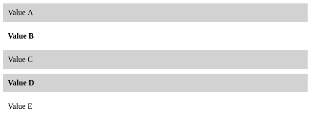

# CSS: Classes

## Classes and ID

Classes and ID allows to add a label to some elements. This label can then be used in the CSS to refine the selection of a subset of elements.

### ID

ID are used to identify a unique element.
(The ID should be unique in the entire webpage.)
For example, a `<p>` element with an id:

```html
<p id="label"> Some text </p>
```

ID are selected in the CSS using `#label`. Example:

```css
#label {
	color: red;
}
```

### Classes

Classes are used to identify a subset of element, and at the opposite of ID, may be reused on different elements.
Example of `<p>` and `<h1>` element with a class:

```html
<h1 class="label"> My title </h1>
<p class="label"> My text </p>
```

Classes are selected in the CSS using `.label`. Example

```css
.label {
	color: red;
}
```

Note: you can define several Classes in one element (ex. `class='label1 label2'`).

__Q.__ Consider the following code

```html
<p class="c1"> Value A </p>
<p class="c2"> Value B </p>
<p class="c1"> Value C </p>
<p class="c1 c2"> Value D </p>
<p> Value E </p>
```

And this incomplete CSS

```css
p {
	margin: 10px;
	padding: 10px;
}
XX {
	background-color: lightgray;
}
YY {
	font-weight: bold;
}
```

Modify `XX`, and `YY` in order to obtain this result



### Selectors with classes

Classes can be combined with names of elements to refine the selection.
`e.l` will select only the element `e` with class `l`

_Note: It is usually useless to refine the selection of an ID, as it defines a unique element._

Example (take care to understand well their differences):
* `p.label`: Select `p` elements with the `label` class.
* `p, .label`: Select all `p` elements, and all elements with `label` class.
* `p .label`: Select elements, child of `p`, with `label` class.

__Q.__ Explain in full text which elements would be selected by these selectors

* `h1.main, .second`
* `h2 .main, #selected, p em.red`
* `body p.selected strong`


## Pseudo classes

Pseudo-classes are used to define a specific state of an element, typically to indicate when the user pass the mouse over the element. Pseudo classes allows CSS to interact (although in a limited way) with the action of the user.

Pseudo classes are used by default on links element `<a>` that change of color when the mouse passes over, and once the link has been visited.
Pseudo classes can however be used on any elements.

__Q.__ Try the following example

* Example 1:

```html
<a href="https://www.polytechnique.edu/"> Link </a>
```

```css
body {
	text-align: center;
	font-size: 200%;

}
a {
	color: blue;
	text-decoration: none; /* take away the default underline */
}

/* The mouse is over the element */
a:hover {
	color: red;
	font-weight: bold;
}

/* The mouse click on the element */
a:active {
	background-color: black;
}
```

__Q.__ Use pseudo class on `<p>` elements to mimic the behavior of [this page](exercice/01_pseudo_class_box/index.html). Note the behavior when passing and clicking over the boxes.

__Q.__ Considering the following HTML body code to mimic a menu

```html
<a id="selected" href=""> Home </a>
<a href=""> News </a>
<a href=""> Contact </a>
<a href=""> About </a>
```

try to create the CSS associated to the [behavior of this page](exercice/02_pseudo_class_menu/index.html).


__Q.__ Try to imitate the behavior of [this page](exercice/03_pseudo_class_appearance/index.html) using pseudo classes.

__Hints__:
* `display:none;` allows to hide an element.
* `e1+e2` is a selector allowing to select the element `e2` immediately following the element `e1`

