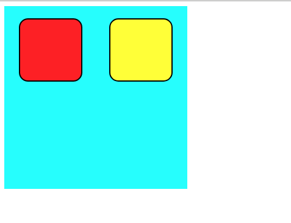

# CSS: Anonymous containers Div and Span


## Role of anonymous container

Remember that HTML5 define a [large number of tags](https://www.w3schools.com/tags/default.asp). Although their display can be fully adapted to the expected one, they are attached to a semantic meaning that should be preserved (ex. `<p>` should be used for a paragraph of text, `<h1>` for titles, `<li>` for listings, etc).

In some situations, we may take advantages of grouping together elements, in order to apply a common CSS rule, or grouping them visually. This group may not have a specific semantical meaning excepted sharing a visual behavior, or may have a semantic which doesn't exists in the existing named tag.

HTML propose two anonymous containers:
* `<div>` which has a block-level semantic
* `<span>` which has an inline-level semantic.

## Syntax

Div and span commonly used with classes in order to define specific groups of elements.


__Q.__ Try the following HTML and CSS code and observe the role of `<div>` and `<span>` to group elements with common visual behaviors.

```html
<div class="rightSide">
<p> This is some paragraph <span class="highlight"> with span <em>elements</em>. </span> </p>
</div>

<div class="center">

	<div class="group1">
		<p> A </p>
		<p> B </p>
	</div>

	<div class="group2">
		<p> C </p>
		<p> <span class="highlight">D</span> </p>
	</div>

</div>
```

```css
.rightSide {
	text-align: right;
}

.center {
	text-align: center;
	display: block;
}

.highlight {
	background-color: yellow;
}

.highlight em {
	color: red;
}

.group1 {
	background-color: pink;
	width: 50px;
}
.group2 {
	background-color: lightgreen;
	width: 100px;
}
```

__Q.__ Try to imitate the following appearance using only `<div>` elements and appropriate classes and CSS.



_Hint:_ Defining some `<div>` width fixed width, height, and a background color make them appearing as colored box.


## Note on `<div>` and `<span>`

1. `<div>` has a default block display, meaning that a new line is started for each `div`, while `span` has a default inline display. As any element, these displays can be changed in order to adapt to your expected layout.
1. `<div>` is allowed to contain `<span>` elements. However, `<span>` elements should not contains `<div>`. Remember that `<div>` has a block-level semantic, while `<span>` is an inline-level semantic. Even if you change their display in CSS, their semantic-level should be preserved by your structure.
1. Every HTML webpage visual layout can be fully defined using only `<div>` elements in place of other one such as `<hi>`, `<p>`, `<li>`, etc. However, your webpage would lose its semantic structure, and this is considered as bad practice. Prefer using when appropriate named tag with semantic meaning, and restrain the use of `<div>` to groups without semantic.
