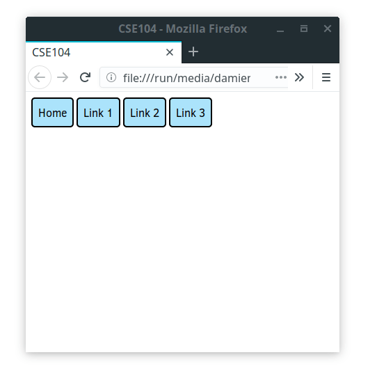

# Responsive

Websites are typically seen from a large range of hardwares with varying screen size: Desktop monitor, laptops, tablets, smartphone.
While standard computer screen have 4/3, or 16/9 format, smartphones exibits more variety and more extreme height/width ratio. Moreover, they may be switched between portait and landscape mode.

A `responsive` design, is a design that remains accessible and look nice on these various screen size.
To achieve this result, the layout may adapt itself depending on the size of the layout.

We already saw several elements able to make your design responsive. Some general rules can be followed:


* Avoid static pixel-defined layout (ex. Placing a container at 200px from the left and 600px from the top to center an element).
    * Prefer relative sizing (percentage of viewport, parent container, font size).
    * Take advantage of the automatic container behavior. Think about the most appropriate display (block, inline, inline-block, flex-box).

* Avoid adding unecessary layout constraints. The default behavior is usually responsive by itself.

* Always check your webpage on various window size. You can also use the device emulator in the develpment tool of your browser.


## Viewport tag

The first required element to make a webpage look nice on mobile is to adapt the scale to the viewport width.
This is done in adding the meta information in the head section of the HTML webpage

```html
<meta name="viewport" content="width=device-width, initial-scale=1">
```

Without this tag, the default rendering on the mobile browser will zoom-out until the entire webpage fits into the screen, leading to tiny text and images.

__Rem.__ Unless you have specific reason, you should always include this viewport tag in your future webpage.


## CSS media

The [CSS media query](https://developer.mozilla.org/en-US/docs/Web/CSS/Media_Queries/Using_media_queries) allows to set specific rules adapting to your device or screen width and height.

### Example 1 - background color:

Consider an empty html webpage and the following CSS code
```css
body {
	background-color: cyan;
}

@media (max-width: 700px) {
	body {
		background-color: yellow;
	}
}

@media (max-width: 500px) {
	body {
		background-color: red;
	}
}
```

For large screen, the background will be cyan. When resizing to a smaller window, the background will become yellow (between 500 to 700px), and then red (bellow 500px).

Using `max-width` appropriately can enable you to make adjustment to the display of your webpage.


### Exemple 2 - Responsive menu

It is common to have horizontal menu on wide screen, while vertical one may be more appropriate for tall one such as for mobile.

__Q.__ Test the following code for varying window width

```html
<header>
<nav>
    <div class="links">
        <a href="">Home</a>
        <a href="">Link 1</a>
        <a href="">Link 2</a>
        <a href="">Link 3</a>
    </div>
</nav>
</header>
```

```css
body {
	text-align: center;
	margin: 2em;
}

a {
	display: inline-block;
	text-decoration: none;
	background: rgba(150,220,250,0.8);
	color: black;
	padding: 1em 2em;
	border: 2px solid black;
	border-radius: 5px;
}

a:hover {
	background-color: cyan;
}

@media (max-width: 600px) {
	a{
		display: block;
	}
}
```

### Exercise

__Q.__ Try to create a webpage that mimic the behavior of the one from `exercise/menu/`.



_Note that typical responsive menu with more general behavior are coded using JavaScript, and not only CSS rules._
