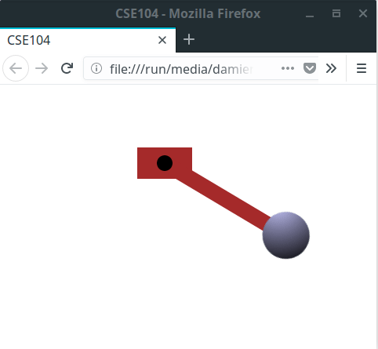

# CSS Animation

## Transitions

We saw that some CSS selectors such as @media, and pseudo classes (ex. `:hover`) can be associated to new appearance. By default, the new appearance take effectimmediately. The [transition](https://developer.mozilla.org/en-US/docs/Web/CSS/CSS_Transitions/Using_CSS_transitions) property allows to generate smooth change between two appearances.

* Consider the following code of the menu we already used
```html
<a href="">Home</a>
<a href="">Link 1</a>
<a href="">Link 2</a>
<a href="">Link 3</a>
```

```css
a {
	display: inline-block;
	text-decoration: none;
	background: rgba(150,220,250,0.8);
	color: black;
	border: 2px solid black;
	border-radius: 5px;

	padding: 0.5em;
}

a:hover {
	padding: 1em;
}
```

* Observe the suddent change of appearance when passing the mouse over the links.
* Add the following property to the `a:hover` rule.
```css
transition: padding 1s;
```
And note that the change of appearance is now smooth.
* When the mouse is leaving the block, come back to its original state immediately. A smooth transition can also be set in adding also the `transition` property to the `a` rule.


__Q.__ Re-create the behavior shown in the webpage from `exercice/01_transition/`. You can re-use the HTML and CSS code you used in the previous part from the similar webpage.


## Keyframes


CSS can handle more general animations using arbitrary keyframes: set of specific extermal positions which are interpolated through time.

__Q.__ Consider the following code

```html
<h1>My title</h1>
```

```css
/** Keyframes of an animation */
@keyframes left-to-right {
	0% {left: 0;}
	100% {left: 80vw;}
}

h1 {
	display: inline-block;
  position: relative;
	padding: 0.5em;
	border: 2px solid black;
	background: yellow;

  /** Specify the animation to play*/
  animation-name: left-to-right;
  animation-duration: 4s;
}
```

* Add the following property to the element to create a infinite looping animation.

```css
animation-iteration-count: infinite;
animation-direction: alternate-reverse;
```

* Add the following extra keyframe to specify a more complex animation at intermediate steps

```css
25% {background-color: lightcyan;}
75% {transform: rotate(25deg);}
```

## Exercices

__Q.__ Create a webpage that has the behavior of the pendulum shown in the directory `exercice/02_pendulum`



Hints:
* You can create a 2D disc from a square in setting `round-border: 50%;`
* The spherical appearance of the sphere is obtained from a [CSS gradient](https://www.w3schools.com/css/css3_gradients.asp). (ex. syntax `background: radial-gradient(circle at X Y, Color1, Color2);`)
* Rotation are applied by default around the center of the element. Applying rotations around an offseted position can be created in composing translations and rotations (ex. `transform: translate(-VALUE) rotate(Theta) translate(VALUE)`;)
