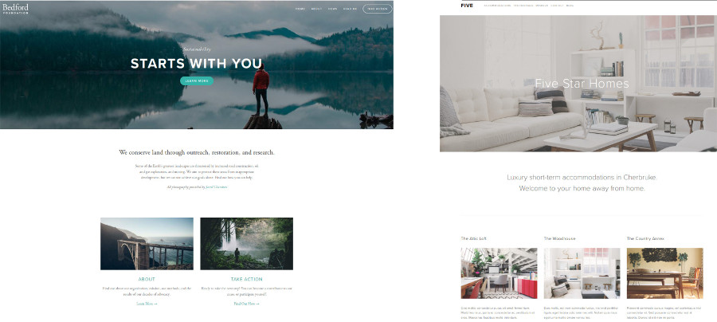

# Template reproduction

Try to reproduce existing front page template design using HTML/CSS.
You can inspire from [squarespace](https://www.squarespace.com/templates) templates.

Possible examples are for instance: [Bedford](https://bedford-demo.squarespace.com/), or [Five](https://five-demo.squarespace.com/) templates.

Hints:
* Try to setup the general element design and size using colored box in a first step.
* Once the general template design is set, fill the elements and text recursively.
