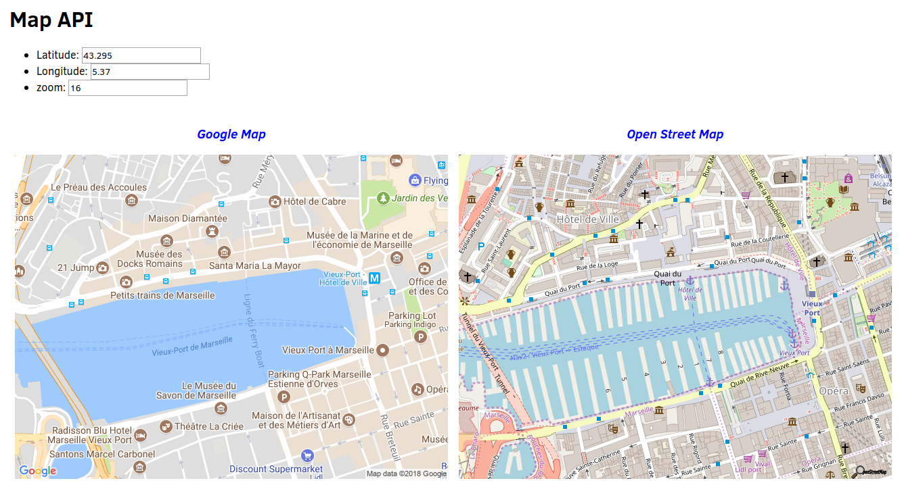

# Third party API

So far you developed webpage with content fully defined locally in the HTML and JavaScript code.
As web browsers have natural abilities to communicate with external ressources, it is possible to integrate content provided from third parties within you own webpage.

Web Application Programming Interface (Web API) are interface able to request ressources from code, thus allowing to automatize interactions with external ressources.

## Web API from url

One of the most simple-to-use Web API consists in querying a ressource using parameters embeeded in the url.

For instance, searching for the word "butterfly" on google can be done in writing in your browser url https://www.google.fr/search?q=butterfly.
* `https://www.google.fr/search`: corresponds to the url from which the ressources can be accessed. It is called the __endpoint__.
* `q=butterfly`: corresponds to the parameter of the query.

Note that actually searching words on Google from Javascript or any automated approach (instead of writing it manually in your browser) would requier to register and pay a fee.

## Maps

### Static images on Google Map 

Google Map propose [various ways](https://developers.google.com/maps/) to query data from their API.

Let us consider the simplest query: a [static image](https://developers.google.com/maps/documentation/static-maps/).

* Type in your browser the following url
[https://maps.googleapis.com/maps/api/staticmap?center=48.712733,2.205253&size=640x400&zoom=12](https://maps.googleapis.com/maps/api/staticmap?center=48.712733,2.205253&size=640x400&zoom=12)

This image is not a pre-stored one, but rendered on demand by Google Map servers to correspond to the parameters.

  * In this case, the endpoint is `https://maps.googleapis.com/maps/api/staticmap`
  * `center=lat,lon` corresponds to the latitude and longitude.
  * `size=640x400` is the size of the image.
  * `zoom=12` is the level of zoom on the exact center point.

* Try to experiment with varying values of the parameters.

__Note__ 

We are using the free keyless access from Google Map service. This free service has [limited usage policies](https://developers.google.com/maps/documentation/static-maps/usage-limits). The maximal resolution of the image is 640x640, and the number of request is also limited.
* Avoid querying large amount of maps using automated approach, especially when querying from the school domain (other students are also querying data).

_For a more professional usage, Google will require that you register your application, and may pay a fee for large amount of request._

_If the server indicates you exceed your daily quota, you can request a [personal API key](https://developers.google.com/maps/documentation/javascript/get-api-key#standard-auth) for free. Then add in the url `&key=YOURKEY`_

### Automatic image request

The static image obtained from the url is a common bitmap image that can be embedded in your webpage.

* Consider the following html code

```html
<h1> Use of Google Map API </h1>


```

__Q.__ Add user inputs allowing to set the latitude, longitude, and zoom level of the map. Every time the user change an input, the map should be updated. 

[Open Street Map](https://www.openstreetmap.org) is another mapping web tool based on open data.
Open Street Map also proposes a [static image API](https://wiki.openstreetmap.org/wiki/StaticMapLite) from the endpoint http://staticmap.openstreetmap.de, and follows the same syntax than Google Map.

* Note the the image may take some time to appear depending on the server response time.

__Q.__ Add a second image obtained from Open Street Map to your previous application.



