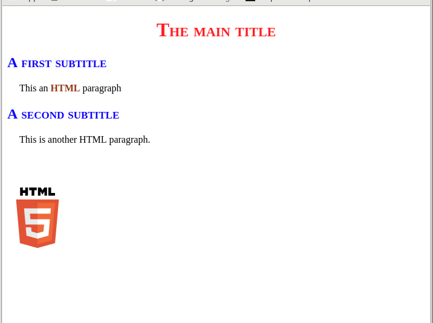
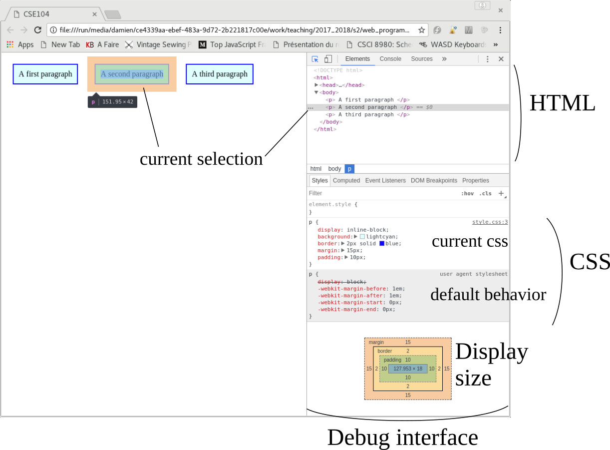

# Introduction to HTML

## Creating a first webpage HTML+CSS

__Q.__ Create a a first minimalist HTML webpage.
* Create a file index.html
* Edit your file using a text editor (for instance [Atom](https://atom.io/), [SublimeText](https://www.sublimetext.com/))
* Fill it with the following code

```html
<!DOCTYPE html>

<html>

<head>
	<title> CSE104 </title>
</head>

<body>
       <h1>My first webpage</h1>
       This is HTML code.
</body>

</html>
```
* Open this file using a web navigator (for instance [Firefox](https://www.mozilla.org), [Google Chrome](https://www.google.com/chrome/browser)).


__Q.__ Create a CSS file (ex. style.css), and add a link to it in the header of your HTML file.

```html
<link rel="stylesheet" href="style.css">
```

Add the following text in the CSS file
```css
body {
	text-align: center;
	background-color: rgb(15,15,15);
	color: white;
}

h1 {
	color: red;
	font-variant: small-caps;
}
```
Observe the change of appearance.

__Note__ As a good practice in general programming you should separate the content description from the visual appearance parameters.
This translates in web programming as follows:
* HTML file should only describe the structure and content of your document. You should avoid encoding your appearance parameter directly in the HTML content (such as color, placement, etc).
* Appearance parameters should be described in CSS file. This file will allow to regroup appearance parameters, and enable the user to quickly modify the webpage look without modifying the content in the HTML file.

### Exercice

__Q.__ Consider the following HTML body.

```html
<h1>The main title</h1>

<h2> A first subtitle </h2>

<p> This an <a href="https://www.w3schools.com/html/">HTML</a> paragraph </p>

<h2> A second subtitle </h2>

<p> This is another HTML paragraph. </p>


```

Adapt the CSS to give the following appearance to the webpage.



__Help__ you may use the following markups
* [margin](https://www.w3schools.com/css/css_margin.asp): to set the margin of the paragraphs. And margin-top to set the empty space on top of the image.
* [width](https://www.w3schools.com/cssref/pr_dim_width.asp) to set the image size.
* [font-weight](https://www.w3schools.com/cssref/pr_font_weight.asp) to set the bold font.
* [text-decoration](https://www.w3schools.com/cssref/pr_text_text-decoration.asp) to handle underlying words. Note that `text-decoration: none;` will disable default parameters.


## Display elements: block and inline


Consider the following HTML content

### inline-block

__Q.__ Modify the body of the HTML file with the following content

```html
<p> A first paragraph </p>
<p> A second paragraph </p>
<p> A third paragraph </p>
```

And the associated CSS
```css
p {
	display: inline-block;
	background: lightcyan;
	border: 2px solid blue;
}
```

Observe that each element is arranged consecutively from left to right.

_inline-block_ elements have well defined width and height.

__Q.__ Set a specific width and height in the CSS and observe the resulting behavior. (ex. `width: 300px;`)

__Q.__ Now without defining a fixed width and height, set a padding of 10px and observe the result. Then set a margin of 15px and observe again the result.

__Q.__ Note that you can observe the block parameters in the debug mode of your navigator (instead of setting a specific background color). Debug mode is usually called by the F12 key. Note that CSS values can be dynamically modified within the debug mode.


_Example of debug mode in the navigator_

* Inline block is a display well suited to organize your elements as consecutive blocks from left to right. Width, height, and spacing between blocks can be defined in the CSS.
Images have by inline-block display by default.

### Block

Let us now consider the following CSS file
```css
p {
	display: block;
	background: lightcyan;
	border: 2px solid blue;
}
```
(Note that block is actually the default behavior for `<p>`)

Observe that each `<p>` block is now on a new line.

__Q.__ Observe the behavior of width and height, and the one from padding and margin.

* Block display is well suited for elements defined on a specific line. Each new block element will be created on a new line.


### Inline


__Q.__ Observe the results, note that each `<p>` has its own line, while the `<span>` elements are consecutive.
Which element is associated to a block display, and which one to an inline display ?

Change display

## Display element

Consider only

<p> A first paragraph </p>
<p> A second paragraph </p>
<p> A third paragraph </p>

- Display block
- color, margin


__Q.__ One way to observe the space occupied by the elements is to set a background color and a border. Change the CSS file into this one

```css
p {
	border: 2px solid coral;
	background-color: rgb(200,200,200);
}

span {
	border: 2px solid blue;
	background-color: rgb(200,200,200);
}
```

Observe the result.

__Q.__ Change the display of the `<p>` element into inline

```css
p {
	border: 2px solid coral;
	background-color: rgb(200,200,200);
	display: inline;
}
```

__Q.__ Modify the file in order to have this output using only basic default elements such as h1, p, strong.


__Q.__ Create a new css file (style.css), and include it in your html document
```html
<link rel="stylesheet" href="styles.css">
```

Setup the CSS file such that the result of the webpage appears like that.


Note that you should keep your html file with the default elements (you may add span to your original file)

Some CSS elements that may be usefull
* [text-align](https://www.w3schools.com/cssref/pr_text_text-align.asp)
* [margin](https://www.w3schools.com/css/css_margin.asp), [padding](https://www.w3schools.com/css/css_padding.asp)
* [color](https://www.w3schools.com/cssref/css_colors.asp)
* [border](https://www.w3schools.com/css/css_border.asp)
* [background-color](https://www.w3schools.com/css/css_background.asp)
* [display](https://www.w3schools.com/cssref/pr_class_display.asp)
* [font-weight](https://www.w3schools.com/cssref/pr_font_weight.asp)
