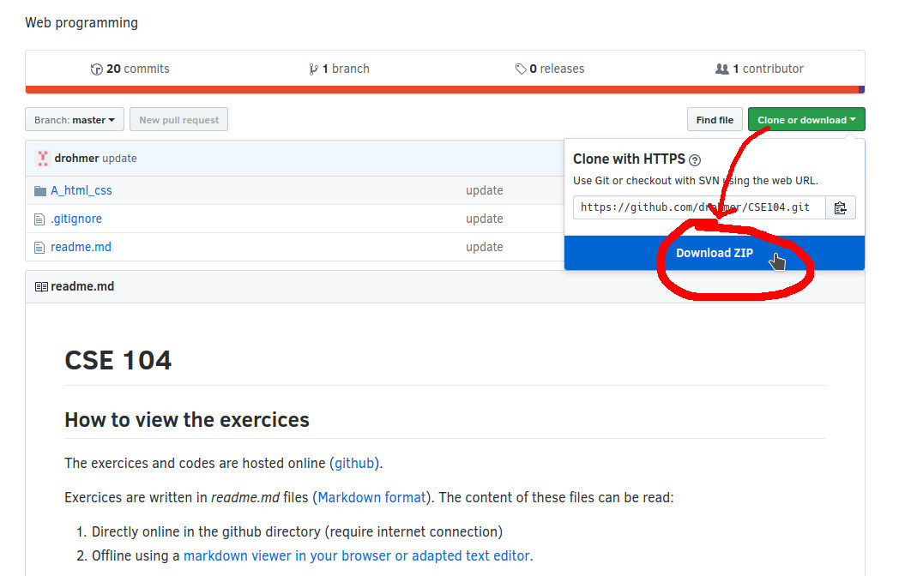

# CSE 104

## How to view the exercices

The exercices and codes are hosted online (using [github](https://github.com/)).

Exercices are written in _readme.md_ files ([Markdown format](https://github.com/adam-p/markdown-here/wiki/Markdown-Cheatsheet)). The content of these files can be read either
1. Directly online in the github directory (require internet connection)
2. Offline using a [markdown viewer in your browser or adapted text editor](https://imagecomputing.net/damien.rohmer/teaching/general/markdown_viewer/index.html).

## How to navigate

Exercices are stored by topics. Each topic is stored in a separated directory and subdirectory.
* Navigate in the exercices in selecting a specific directory (ex. [A_html_css/](A_html_css/), and then [A_html_css/01_html_basic/](A_html_css/01_html_basic/))
* Some exercices may be provided as code in _/src/_ directories.

_Note_ 
* Different directories may have varying length and complexity.
* Topics are thought to be followed in the order of the directories.

To access to the content of the lab class and the code, you should also download the entire structure on your computer. Proceedure explained as follow

### Download as a zip archive

* Simplest to start with
* In the case where the repository is updated, you will need to download a new Zip archive.

### Alternative: use git subversion

As an alternative to zip download, you may use git subversion.
* In a Unix shell  
`git clone https://github.com/drohmer/CSE104.git`
* In Windows, need a GUI tool such as [git for windows](https://gitforwindows.org/)

Using git allow you to update the code repository using the command
`git pull`
